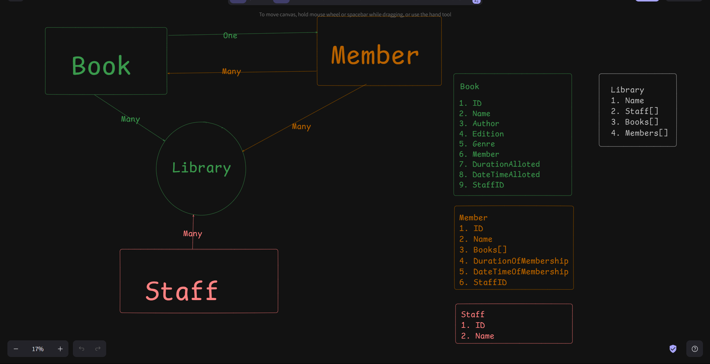

## Diagram

## Planning
- I have a database.json file, which will contain all the data of the application
- and the data will be arranged in the same relationship as dicussed in the diagram
- I have created a file named dbConfig.py to hold the object of loaded data for the library - which is practical hold the connection object to the database server 
- I have created service files for each entity i.e. Book, Staff, Member, Library - which will contain all the validation and any other kind of operation that is required before the data is updated or saved into database. 
- I have created another file named repository.py to have all the operations regarding database, like insert, update, read, delete

### application flow
1. In config we will create a library username and password which will be the library admin username and password
2. The only operation that is allowed for now to the admin user is to create a new staff
3. All the staff members will now be holding same power and access to the application
4. Staff will be asked to login to our application on application startup
5. There will be an option to logout fo the application, but the application will remain running
6. Pressing Ctrl+C will close the application or .quit will close the application
7. Staff will be able to add new member and new books
8. Also the staff will be able to allot books to the user and free the books once they are returned from the member
9. if in future we introduce late fee or any other kind of fee will write logic accordingly
10. Also there is for no option for member login, but we can discuss and add